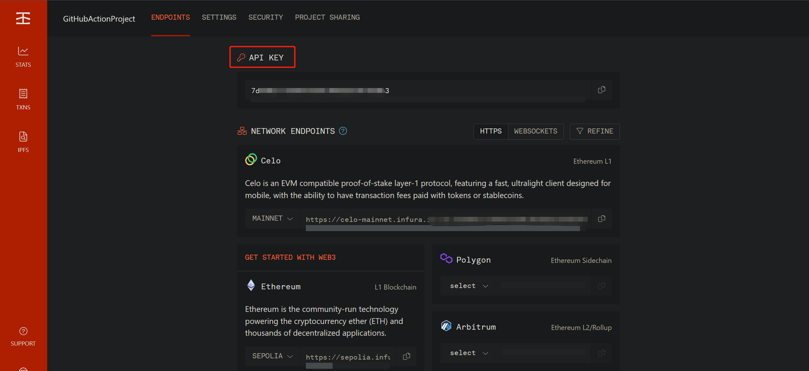
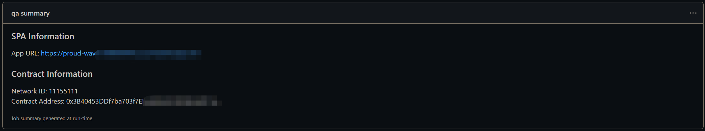

# React Pipeline Box

This box is a starter template that combines the DevOps Pipeline with [Truffle React-Box](https://trufflesuite.com/boxes/react/).

The [Pipeline](docs/Pipeline.md), built using **GitHub Action**, contains **Dev** and **QA** environment. The **Dev** environment deploys the application to a personal Ethereum blockchain using [Ganache](https://next-stack.github.io/ganache/) running in a container hosted by [Azure Container Instances](https://learn.microsoft.com/en-us/azure/container-instances/container-instances-overview) and QA deploys to the [Sepolia testnet](https://sepolia.dev/). The frontend will be hosted in [Azure Static Web Apps](https://learn.microsoft.com/en-us/azure/static-web-apps/overview).

## Installation

You can install the box with Truffle:
```powershell
truffle unbox lijie-lee/react-pipeline-box
```

## Setup

The pipeline file and scripts related will be after unboxing. This section will introduces how to setup the project.

- [Prepare](#prepare)
- [Trigger pipeline](#trigger-pipeline)
- [Check pipeline results](#check-pipeline-results)

### Prepare

Before push the project to GitHub remote to trigger GitHub Action, some configurations and steps need to be done.

#### 1. Create AZURE_CREDENTIALS

Create [Azure_CREDENTIALS](https://learn.microsoft.com/en-us/azure/active-directory/develop/howto-create-service-principal-portal) for deploying Azure Resource. The format is as follow:

```json
{
    "clientId": "xxxxxxxxxxxxxxxxxxxxxxx",
    "clientSecret": "The 'Value' of Client Secrets",
    "subscriptionId":"xxxxxxxxxxxxxxxxxxxxxxx",
    "tenantId":"xxxxxxxxxxxxxxxxxxxxxxx"
}
```

#### 2. Create Infura Project

Create project on [infura](https://app.infura.io/dashboard) for deploying contracts to testnet in the QA job of pipeline. After creating, obtain the **API KEY**.



#### 3. Request TestNet Ether

As deploying contracts to testnet cost ether, your account should own enough test ether. If not, request some from [faucet](https://faucetlink.to/sepolia).


#### 4. Configure settings of repository

Configure variables needed by the pipeline in settings page of GitHub repository.

Create three **Actions secrets**:
```json
{
    "Name": "AZURE_CREDENTIALS",
    "Secret": "the content of AZURE_CREDENTIALS"
}
{
    "Name": "API_KEY",
    "Secret": "API KEY of infura project"
}
{
    "Name": "MNEMONIC",
    "Secret": "MNEMONIC of your account owns sepolia ETH"
}
```

#### 5. Configure validation approvers for pipeline

The Azure resources, created by the pipeline, should be deleted once they are no longer needed. Before deleting, there is an opportunity for the approvers to review the code. 

Configure the **DEV_VALIDATION_APPROVERS** and **QA_VALIDATION_APPROVERS** in the **.github/workflow/pipelines.yaml** file. 

An issue will be created to block the pipeline and wait for approval. The approvers need to respond the issue and then the pipeline will automatically continue and the issue will be closed.

  _This interaction job relies on a third-party github action. For more detail, check [manual-approval](https://github.com/trstringer/manual-approval)_

### Trigger pipeline

After preparing all configurations and steps, push the project to remote to trigger pipeline.

> By default, The pipieline will be triggered only when events of **push** and **pull_request** happen on the **main** branch.

### Check pipeline results

On the summary page of GitHub Action, there are some results generated by the pipeline.

1. **Artifacts** generated by action, including test results and compiled codes


2. **dev summary** generated by dev job.

Add the test account to Metamask and check your DApp by navigating to the **App URL**.


3. **qa summary** generated by qa job.

Check your DApp by navigating to the **App URL**.

> Remember add your Sepolia account to metamask.





_note_: 

- _For only setuping the box locally, check [React-Box Setup](https://trufflesuite.com/boxes/react/#installation)_

## Further information

### Difference from React-Box

[Difference](docs/DifferenceFromReact.md)

## FAQ

- How to use metamask?

1. [Getting started with MetaMask](https://metamask.zendesk.com/hc/en-us/articles/360015489531)
2. [How to add a custom network RPC](https://metamask.zendesk.com/hc/en-us/articles/360043227612-How-to-add-a-custom-network-RPC)
3. [Using MetaMask with Ganache](https://trufflesuite.com/docs/truffle/how-to/truffle-with-metamask/#using-metamask-with-ganache)

- Find more Q&A by [QA](docs/QA.md)


