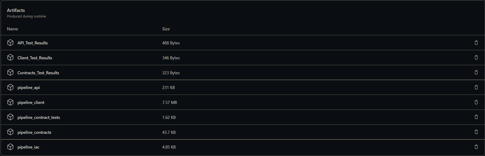
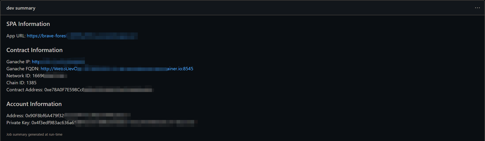

# Tutorial of react-pipeline-box

_The pipeline contains 6 jobs: **build**, **dev**, **dev_validation**, **qa**, **qa_validation**, **prod**. So far, only the jobs of **build** and **dev** are implemented_

## prerequisite

- [Installation - Truffle Suite](https://trufflesuite.com/docs/truffle/how-to/install/)

- [Git - Downloads (git-scm.com)](https://git-scm.com/downloads)

- [AZURE_CREDENTIALS](https://learn.microsoft.com/en-us/azure/active-directory/develop/howto-create-service-principal-portal)

  The AZURE_CREDENTIALS is a **JSON** object of which the format is as follow:

  ```json
  {
    	"clientId": "xxxxxxxxxxxxxxxxxxxxxxx",
  	"clientSecret": "xxxxxxxxxxxxxxxxxxxxxxx",
  	"subscriptionId":"xxxxxxxxxxxxxxxxxxxxxxx",
  	"tenantId":"xxxxxxxxxxxxxxxxxxxxxxx"
  }
  ```

## steps

1. Create a repository on GitHub

2. Create **Actions secrets** on the setting page of repository. Make sure:

   - the value of  **Name** is **AZURE_CREDENTIALS**
   - the value of **Secret** is the **content** of **AZURE_CREDENTIALS** created in [prerequisite](#prerequisite)

3. Clone repository to local

4. Unbox **react-pipeline-box** by running **truffle unbox** in the repository directory

   ```powershell
   truffle unbox lijie-lee/react-pipeline-box
   ```

   _Input **Y** when the message **? Proceed anyway?**  is prompted_

5. Push the _files_ and _directories_ unboxed to remote

   _make sure the branch name is **main**_

_The above 5 steps are all the things needed to be done. Wait for the action to finish executing and then checkout the results._

## Action result

1. **Artifacts** generated by action, including test results and compiled codes

   

2. **Summary** generated by **dev** job. The summary contains:

   - SPA Information
     - App URL 
   - Contract Information
     - Ganache IP
     - Ganache FQDN
     - Network ID
     - Contract Address
   - Account Information
     - Address
     - Private Key

   
