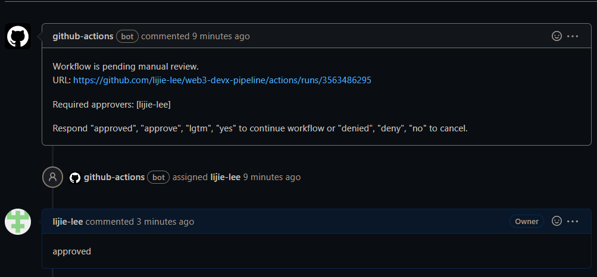

# Tutorial of react-pipeline-box

_The pipeline contains 6 jobs: **build**, **dev**, **dev_validation**, **qa**, **qa_validation**, **prod**. So far, only the jobs of **build**, **dev** and **QA** are implemented. In the QA job, the contracts will be deployed to Sepolia TestNet._

## prerequisite

- [Installation - Truffle Suite](https://trufflesuite.com/docs/truffle/how-to/install/)

- [Git - Downloads (git-scm.com)](https://git-scm.com/downloads)

- [AZURE_CREDENTIALS](https://learn.microsoft.com/en-us/azure/active-directory/develop/howto-create-service-principal-portal)

  The AZURE_CREDENTIALS is a **JSON** object of which the format is as follow:

  ```json
  {
    	"clientId": "xxxxxxxxxxxxxxxxxxxxxxx",
      "clientSecret": "The 'Value' of Client Secrets",
      "subscriptionId":"xxxxxxxxxxxxxxxxxxxxxxx",
      "tenantId":"xxxxxxxxxxxxxxxxxxxxxxx"
  }
  ```

- Create project on [infura](https://app.infura.io/dashboard). Obtain the **API KEY** and **Network Endpoint** from the project.
  

- Requset TestNet Ether, e.g. sepolia Ether, from [faucet](https://faucetlink.to/sepolia) for you account

## steps

1. Create a repository on GitHub

2. Create three **Actions secrets** on the setting page of repository:
   ```json
   {
      "Name": "AZURE_CREDENTIALS",
      "Secret": "the content of AZURE_CREDENTIALS created in prerequisite"
   }
   {
      "Name": "API_KEY",
      "Secret": "API KEY of infura project created in prerequsite"
   }
   {
      "Name": "MNEMONIC",
      "Secret": "MNEMONIC of your account has sepolia ETH"
   }
   ```

3. Clone repository to local

4. Unbox **react-pipeline-box** by running **truffle unbox** in the repository directory

   ```powershell
   truffle unbox lijie-lee/react-pipeline-box
   ```

   _Input **Y** when the message **? Proceed anyway?**  is prompted_

5. Configure the **DEV_VALIDATION_APPROVERS** and **QA_VALIDATION_APPROVERS** in the ".github/workflow/pipelines.yaml" file.
   The variable is used for approve validation job to delete Azure resources created during pipeline.
   
   _This interaction job relies on a third-party github action. For more detail, check [manual-approval](https://github.com/trstringer/manual-approval)_

6. Push the _files_ and _directories_ unboxed to remote

   _make sure the branch name is **main**_

7. Approve **dev_validation** and **qa_validation** job.

   The aim of **dev_validation** and **qa_validation** is to delete resources created by **dev** and **qa**. Before performing the deleting command, an issue will be created and asigned to user to confirm that it's ready to do the deleting job.

   Follow the message of issue and respond the corresponding word to continue.

      

## Action result

1. **Artifacts** generated by action, including test results and compiled codes

   

2. **Summary** generated by **dev** and **QA** job. The summary contains:

- dev summary
   - SPA Information
      - App URL 
   - Contract Information
      - Ganache IP
      - Ganache FQDN
      - Network ID
   - Contract Address
      - Account Information
      - Address
      - Private Key

   

- qa summary
   - SPA Information
      - App URL
   - Contract Address
      - Network ID
      - Contract Address

   

